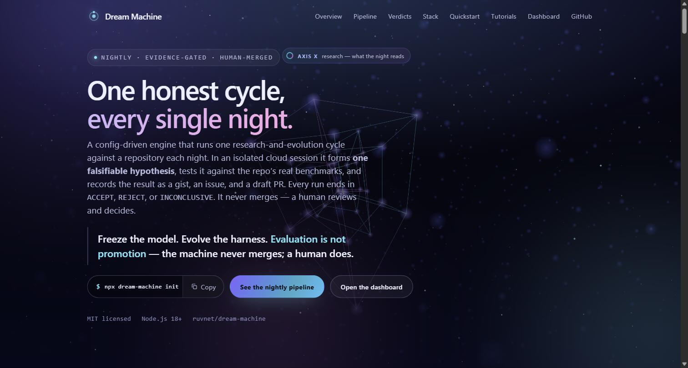

<div align="center">

<a href="https://ruvnet.github.io/dream-machine/" title="Open the live site — interactive 4D hero"></a>

# ☾ Dream Machine

**A config-driven engine for nightly, cloud-scheduled, evidence-gated repository evolution.**

[](https://github.com/ruvnet/dream-machine/actions/workflows/ci.yml)
[](https://github.com/ruvnet/dream-machine/actions/workflows/codeql.yml)
[](https://www.npmjs.com/package/dream-machine)
[](LICENSE)
[](https://ruvnet.github.io/dream-machine/)

**[Website & walkthrough →](https://ruvnet.github.io/dream-machine/)** · **[Dashboard](https://ruvnet.github.io/dream-machine/dashboard.html)** · **[Tutorials](https://ruvnet.github.io/dream-machine/tutorials.html)** · **[ADR-0001](docs/adrs/ADR-0001-dream-machine-engine.md)**

</div>

> Freeze the model. Evolve the harness. **Evaluation is not promotion** — the
> machine never merges; a human does.

```bash
npx dream-machine init --repo owner/name --out dream.config.json
npx dream-machine compile dream.config.json --out PROMPT.md
```

---

## What it is

The Dream Machine turns *"run one research-and-evolution cycle against a
repository every night"* into a **config-compiled engine** instead of a
hand-maintained megaprompt. It wakes up in an isolated cloud session, forms one
falsifiable hypothesis, measures it against the repo's real evaluators, and
writes down what it learned — whether or not the answer was the one it hoped
for.

It is the generalization of two routines already running nightly against
[`ruvnet/ruflo`](https://github.com/ruvnet/ruflo) and
[`ruvnet/metaharness`](https://github.com/ruvnet/metaharness). Both are ~800-line
prompts running the same 26-step pipeline; they differ only in a small,
well-defined per-repo delta. The Dream Machine factors the shared spine into an
engine and the differences into a `dream.config`.

## The nightly pipeline

<div align="center"><a href="https://ruvnet.github.io/dream-machine/#pipeline" title="See it animate on the live site"></a></div>

```
ledger → research → frozen hypothesis → concrete candidate → baseline
  → evaluation → adversarial critique → bounded Darwin evolution
  → flywheel evidence → witness → issue → draft PR → durable ledger row
```

Every night ends in exactly one verdict — **`ACCEPT`**, **`REJECT`**, or
**`INCONCLUSIVE`** — never a fourth, never silence. A rejected hypothesis with a
clean measurement is a *successful* night. The system optimizes for shrinking
tomorrow's search space, not for producing PRs.

## Install & CLI

```bash
npm i -g dream-machine       # or use npx

dream-machine init --repo owner/name --out dream.config.json   # scaffold a config
dream-machine compile dream.config.json --out PROMPT.md        # config → routine prompt
dream-machine schedule dream.config.json --out routine.json    # cloud /schedule body
dream-machine ledger verify  --path docs/dream-cycle/LEDGER.md # structural checks
dream-machine ledger signals --path docs/dream-cycle/LEDGER.md # STEP 1.1 learning signals
dream-machine witness stamp  report.md <commit>                # provenance stamp
dream-machine witness verify report.md <commit> <witness>      # 5-step verify
dream-machine tui --path docs/dream-cycle/LEDGER.md            # the dashboard, below
```

### The TUI

<div align="center"></div>

### The management console

A browser dashboard renders the ledger as recent nights, verdict distribution,
and per-night evidence — the same data the TUI shows.

<div align="center"><a href="https://ruvnet.github.io/dream-machine/dashboard.html" title="Open the live management dashboard"></a></div>

## Schedule it — nightly, autonomous, always improving

The Dream Machine is built to run itself on a schedule. In **Claude Code**, the
built-in **`/schedule`** command creates a cloud routine that runs the pipeline
against your repo every night — autonomous research, evaluation, and
improvement that compounds while you sleep.

**1 — generate the routine body from your config:**

```bash
npx dream-machine schedule dream.config.json --env <your-cloud-env-id> --out routine.json
```

**2 — create the routine.** In Claude Code, type `/schedule`, choose a nightly
cron (e.g. `0 9 * * *` UTC) and your target repo, and paste the routine body
from `routine.json` — or, better, paste the tiny **self-hosting prompt** below.

**The prompt to paste into `/schedule` (recommended).** Rather than freeze a full
prompt, point the routine at a bootstrap that compiles tonight's instructions
from your committed `dream.config.json`, so the schedule can never drift from the
repo. This is the exact prompt that runs against this repository every night —
just change the repo slug:

```text
You are the Dream Machine nightly runner for ruvnet/dream-machine, checked out fresh on main.

STEP A — build the engine (a fresh checkout has no dist/):
  npm ci && npm run build || true          # a wasm/NAPI failure is a recorded degradation, not a stop

STEP B — compile tonight's instructions from the committed config:
  npx dream-machine compile dream.config.json --out /tmp/tonight.md
  cat /tmp/tonight.md

STEP C — follow /tmp/tonight.md EXACTLY: the full 26-step pipeline
  (ledger → research → frozen hypothesis → candidate → baseline → evaluation →
   adversarial critique → bounded Darwin → evidence → witness → issue → DRAFT PR → ledger row).

Invariants: end in exactly one of ACCEPT | REJECT | INCONCLUSIVE (INCONCLUSIVE
with LLM_EVAL=blocked when there's no API key is a legitimate, successful night).
Evaluation is not promotion — NEVER merge, NEVER self-promote. Publish a public
gist + a labeled issue + a DRAFT PR, and append exactly one row to
docs/dream-cycle/LEDGER.md every run. Never weaken a test; never force-push.
```

> Prefer to keep the whole prompt inline instead of the bootstrap?
> `npx dream-machine compile dream.config.json` prints the full 26-step routine —
> paste that into `/schedule` directly.

**What each night does** — research SOTA for tonight's rotation surface → freeze a
falsifiable hypothesis → build a concrete candidate → evaluate parent vs.
candidate on your real benchmarks → adversarial critique + reward-hack check →
bounded Darwin evolution → witnessed evidence → gist + issue + **draft** PR → one
ledger row. Win, lose, or draw, it records what it learned so tomorrow's search
space is smaller. **This repository runs exactly this loop on itself** (cron
`0 9 * * *`) — browse its
[dream-cycle issues](https://github.com/ruvnet/dream-machine/issues?q=label%3Adream-cycle),
gists, and draft PRs to see it in action.

> No `dream.config`? `npx dream-machine init --repo owner/name` scaffolds one.
> A night with no API key still runs — it reports `LLM_EVAL=blocked`, an honest
> `INCONCLUSIVE`, rather than faking a result.

### Or: the optional GitHub Actions "dream" (no cloud agent needed)

Prefer to stay entirely inside GitHub? [`.github/workflows/dream-nightly.yml`](.github/workflows/dream-nightly.yml)
runs the **research + hypothesis** half of the pipeline from a plain CI runner
using an [OpenRouter](https://openrouter.ai) model, files a witnessed
`dream-cycle` research issue, and opens a draft PR that appends one ledger row.

```yaml
# add repo secret OPENROUTER_API_KEY (+ optional var OPENROUTER_MODEL),
# then uncomment the schedule in dream-nightly.yml:
schedule:
  - cron: '0 9 * * *'
```

Honest scope: candidate evaluation, bounded Darwin, and the promotion gate need
the agentic `/schedule` session, so this CI path is **research-only** — every
night is an `INCONCLUSIVE` research night, and with no key it degrades to
`LLM_EVAL=blocked` rather than fabricating a finding. It's disabled by default
and also runs on demand via **Run workflow** (with a dry-run option).

## What it composes (never reimplements)

The heavy stages delegate to the ruvnet stack as **optional, config-selected
backends** — a night without any of them is a *degraded* night, not a failed one.

| Capability | Package | Used for |
|---|---|---|
| Promotion gate + receipts + replay | [`@metaharness/flywheel`](https://www.npmjs.com/package/@metaharness/flywheel) | evidence retention + promotion gate |
| Bounded evolution | [`@metaharness/darwin`](https://www.npmjs.com/package/@metaharness/darwin) | the fenced Darwin stage |
| Adversarial red/blue | [`@metaharness/redblue`](https://www.npmjs.com/package/@metaharness/redblue) | adversarial critic + reward-hack scan |
| Security scan / genome / audit | [`metaharness`](https://www.npmjs.com/package/metaharness) CLI | security review + discovery |
| Vector memory over prior nights | [`@ruvector/wasm`](https://www.npmjs.com/package/@ruvector/wasm) · [`@ruvector/rvf-wasm`](https://www.npmjs.com/package/@ruvector/rvf-wasm) | optional semantic recall (RVF container) |

## Packages

| Package | What it does |
|---|---|
| [`dream-machine`](packages/cli) | the CLI (`init/compile/schedule/ledger/witness/tui`) + TUI |
| [`@dream-machine/compile`](packages/compile) | `dream.config` → the full routine prompt (deterministic) |
| [`@dream-machine/ledger`](packages/ledger) | the 10-column `LEDGER.md` toolkit + learning signals |
| [`@dream-machine/witness`](packages/witness) | `sha256(sha256(report) + commit)` stamp / verify |
| [`@dream-machine/schedule`](packages/schedule) | the cloud `/schedule` routine body emitter |
| [`@dream-machine/memory`](packages/memory) | optional ruvector/RVF semantic memory, flat-file fallback |

## Safety

The Dream Machine runs autonomously, so its guarantees are enforced in code and
CI, not just documented (see [SECURITY.md](SECURITY.md) and
[ADR-0001](docs/adrs/ADR-0001-dream-machine-engine.md)):

- **Evaluation is not promotion.** The session never merges and never
  self-promotes; it opens *draft* PRs only.
- **Guarded auto-merge.** Auto-merge is disabled in the default configuration.
  The optional job refuses any PR touching a
  protected path (gates, safety, thresholds, CI, dependency manifests) and
  requires an explicit label plus green required checks. The session never runs
  the merge itself.
- **Optional deps stay optional** (ADR-150) — a CI job proves the engine builds
  and tests with the ruvector wasm backends absent.
- **Witnessed provenance** — every report is bound to its commit by a
  reproducible double-sha256 anyone can re-derive.

### Proposed Home Core edge program

The [Home Core implementation mission](docs/plans/2026-09-04-dream-machine-home-core-implementation.md)
extends the evidence-gated engine toward an offline UNO Q sensing appliance,
RuView Home Core, real RuVector memory, a local MCP facade, and an optional
Apple HealthKit bridge. The proposal keeps Dream Machine as the build and
evidence control plane: models and self-evolving candidates never receive
direct actuator, promotion, signing, or merge authority. Start with
[ADR-0100](docs/adrs/ADR-0100-edge-runtime-trust-boundaries.md). No bedside
runtime or hardware-safety claim is implemented by this documentation change.

## Prior art

The design answers a known failure mode of open-loop autonomous research agents
(Sakana AI's "The AI Scientist" reward-hacking incident; AutoGPT/BabyAGI-era
loops with ~5% follow-through). The promotion gate, adversarial critic,
reward-hack check, and human-only merge boundary exist precisely because of them.

## License

MIT © [rUv](https://github.com/ruvnet)
