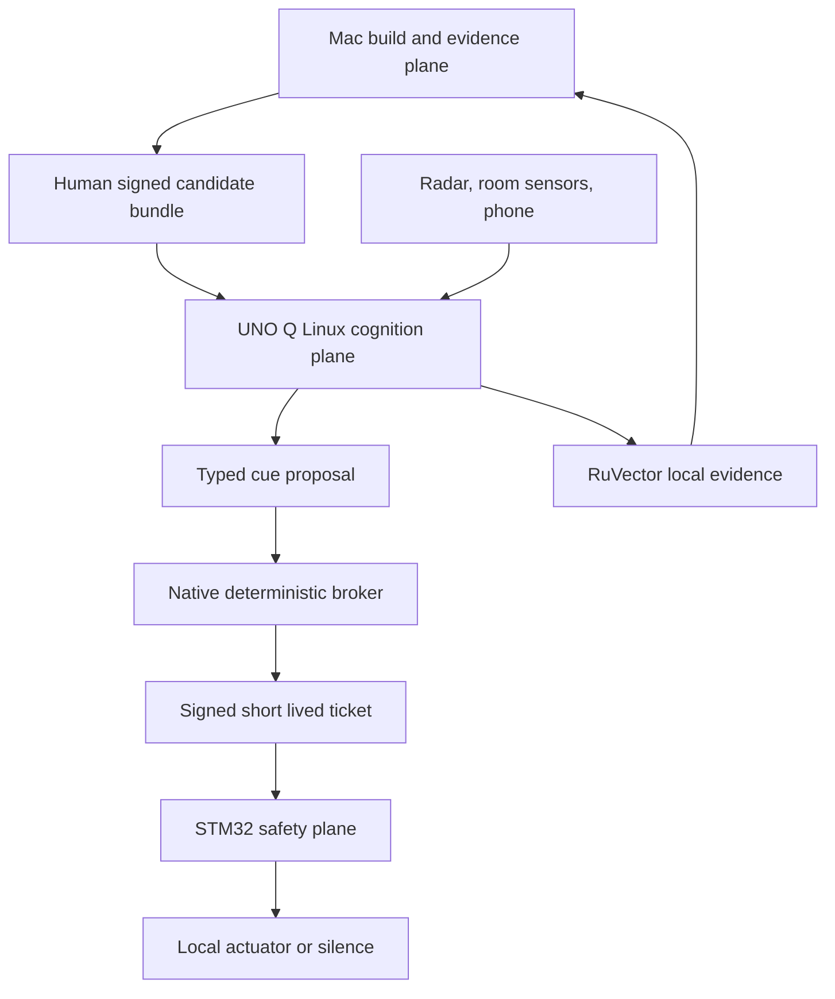

# Dream Machine Home Core edge program

**Status:** Proposed implementation mission

**Date:** 2026-09-04

**Repository baseline:** `ruvnet/dream-machine@7933c3599abe22df5290f4609d1f93f598feb3de`

**Target:** Mac Studio development control plane, Arduino UNO Q bedside pod,
RuView Home Core, RuVector, iPhone HealthKit bridge, optional Apple Watch
research app, MetaHarness, Autogenous or Darwin, and optional LatentMesh nodes.

## 1. Executive decision

Build the program in two distinct systems:

1. Dream Machine remains the build, simulation, evaluation, evidence, and human
   promotion control plane.
2. The bedside system is an offline edge runtime with a Linux cognition plane
   and an independent STM32 actuator-safety plane.

The Mac coordinates a Codex Desktop and Ruflo engineering swarm. It is not a
nightly runtime dependency. The model, WebUI, MCP, RuVector, Apple Watch,
Autogenous, LatentMesh, and RuView plugins may observe, retrieve, explain, and
propose. None can directly energize a speaker, light, or haptic driver.

The first sleep cue use case is one short immutable audio asset reviewed while
awake and used only in a supervised research protocol.
Practical passive profiles ship before exotic cue profiles. A simulator, signed
cue-ticket verifier, physical mute, and observation-only run precede every live
actuator.

The strongest premise correction is that "self evolving" cannot mean live code
rewriting. In this program:

1. Self learning updates local memories, embeddings, calibration, and uncertainty.
2. Self optimization chooses inside a signed, bounded policy that includes silence.
3. Self evolution generates one typed candidate for replay and shadow evaluation.
4. Human promotion signs and deploys an accepted artifact to an inactive slot.

Consent, safety limits, evaluators, retention, network policy, signing, protected
paths, and merge controls never self evolve.

## 2. Why this is a program, not a feature patch

The DigiKey and Arduino Dream Lab challenge is the hardware catalyst for this
mission. It is not evidence that the proposed integrations, sensing accuracy,
or dream influence already work.

Repository inspection found that the current codebase is a TypeScript nightly
repository-evolution engine. It has 98 passing tests and clear evidence and
promotion principles, but it does not yet contain the proposed edge stack:

| Capability | Current state on `main` | Program action |
|---|---|---|
| Dream Machine compile, ledger, witness, schedule, CLI | Implemented | Reuse as control and evidence plane |
| RuVector memory | Module probe plus flat implementation | Build and verify a real adapter; never mislabel fallback |
| RuVector WASM | Optional package reference | Use only for a redacted browser cache after conformance tests |
| RuView Home Core | Absent | Compose through a pinned ARM64 adapter and upstream contracts |
| UNO Q runtime and firmware | Absent | Add simulator first, then Linux deployment and STM32 safety firmware |
| MCP and `ruv://` | Guidance only | Build a capability-minimal local server and strict URI parser |
| Apple Watch and HealthKit | Absent | Ship retrospective iPhone import first; live Watch is research only |
| Autogenous | Absent | Add a typed candidate adapter after replay and authority tests |
| LatentMesh | Absent | Evaluate authenticated remote-node transport outside safety timing |
| Physical actuation | Absent | Keep disabled until independent-controller and HIL gates pass |
| Mac and Codex Desktop workflow | Absent | Use a dedicated, least-privilege build and release control plane |

Open PRs already explore trace attribution, replay, statistical validity,
evidence-carrying termination, and claim-relative receipts. This plan references
those ideas without depending on unmerged code. ADRs use the 0100 range to avoid
the existing 0003 through 0005 collisions.

## 3. Product outcome and measurable value

The first valuable product is a privacy-sovereign personal sensing appliance,
not a dream controller. It should create:

1. Reliable local observation and a useful morning journal with no cloud
   dependency and user-controlled deletion.
2. Replayable personal experiments which distinguish benefit, null, and harm.
3. A reusable governed edge platform for practical and exotic profiles without
   giving those profiles ambient authority.

Program success requires:

1. More than 99 percent completed nightly runtimes.
2. More than 85 percent usable signal windows.
3. Zero unexpected WAN egress over 24 hours.
4. Zero unauthorized physical actions across one million malformed requests and
   ten thousand restart and fault sequences.
5. Every candidate, exposure, denial, promotion, and rollback backed by a
   reproducible receipt.
6. A clean Mac build which can disconnect from WAN before compiling, testing,
   benchmarking, and packaging unsigned artifacts.

Dream-influence success is a later research result, not an MVP assumption.

## 4. Scope

### 4.1 In scope

1. Mac Studio reproducible development and evidence workflow.
2. Ruflo-coordinated Codex engineering swarm with isolated worktrees.
3. Shared edge schemas, canonical cue tickets, simulator, virtual clock, and faults.
4. UNO Q Linux services and STM32 independent safety controller.
5. 60 GHz radar, room sensors, local wired audio, and optional external ESP32 CSI.
6. RuView Home Core state, history, automation, voice, and signed WASM composition.
7. Real local RuVector stores, versioned representations, and redacted WASM cache.
8. Local MCP through stdio or current Streamable HTTP and project `ruv://` resources.
9. Retrospective Apple Watch data imported through an iPhone HealthKit companion.
10. Optional, separately approved live Apple Watch research mode.
11. Contrastive context matching plus randomized causal experiments.
12. Autogenous or Darwin typed proposals and MetaHarness evaluation.
13. Signed A and B release slots, rollback, SBOM, provenance, and witnesses.
14. Audio-first dream-theme research after observation and safety gates.

### 4.2 Explicitly out of scope for the first release

1. Dream reading, decoding, control, diagnosis, treatment, or guaranteed outcomes.
2. Radar-only claims of reliable REM staging or EEG phase locking.
3. A model-callable actuator, arm, resume, flash, sign, promote, or merge tool.
4. Generated spoken content while a user sleeps.
5. Cloud-required sensing, memory, cue timing, safety, or rollback.
6. Children, non-consenting occupants, multi-occupant cueing, or hidden monitoring.
7. Consumer electrical, vestibular, magnetic, ultrasound, pressure, scent, or
   active thermal stimulation.
8. Automatic capability expansion or self-modifying safety and evaluator code.
9. HomePod as the deterministic research cue actuator.
10. Apple Watch as real-time ground truth or direct actuation authority.

## 5. System architecture



### 5.1 Mac build and evidence plane

The dedicated Mac account builds, simulates, fuzzes, benchmarks, packages, and
presents candidates for human approval. Ruflo coordinates work. Codex Desktop
uses computer control only for Xcode, Simulator, Instruments, Console, and
Arduino UI steps without a stable API. It stops for credentials, permissions,
signing, physical flashing, actuation, promotion, release, and merge.

### 5.2 UNO Q Linux cognition plane

The 4 GB UNO Q runs Debian on the Qualcomm QRB2210. Planned services ingest
RuView and room observations, align clocks, estimate state probabilities, write
RuVector episodes, serve the local WebUI and MCP facade, execute fixed policies,
and produce `CueProposal` objects. Services run as distinct unprivileged users.

The Linux plane may render signed audio for awake preview. A sleep cue is
rendered from an immutable asset selected and digest checked by the STM32, so a
compromised Linux renderer cannot substitute content during a valid gate.

### 5.3 STM32 actuator-safety plane

The STM32U585 starts disarmed and owns physical arm, mute, abort, watchdog,
monotonic scheduling, replay protection, intensity and duration ceilings,
cumulative dose, quiet periods, asset allowlist, output enables, and receipts.
It rejects rather than clamps invalid tickets. Loss of Linux, heartbeat, clock
integrity, policy, consent, direct safety sensor quality, or signature produces
silence.

### 5.4 Sensor plane

The initial contactless sensor is an MR60BHA2-class 60 GHz module for presence,
motion, respiration estimate, and coarse cardiac-motion estimate. These are
wellness and state features, not medical measurements. Ambient light,
temperature, humidity, and calibrated room sound add context.

The UNO Q onboard WiFi radio has no documented CSI API. Optional CSI therefore
uses an external ESP32 C6 or S3 and an exact versioned binary transport. Bulk CSI
goes to Linux, not through Arduino Router. The production radar path reaches the
STM32 directly. Every enabled sleep cue profile requires a fresh MCU visible
presence and safety quality snapshot, so a Linux failure cannot fabricate sensor
health. Optional CSI remains advisory and cannot satisfy this requirement.

### 5.5 Apple plane

The production path requires only an iPhone app. It uses HealthKit observer and
anchored queries to import authorized Apple Watch sleep and overnight measures
after the night, stores batches transactionally in an encrypted outbox, pairs
physically with one pod, and sends signed batches over pinned local TLS.

Apple Watch data is advisory. Missing, delayed, unsupported, or revoked values
never weaken the local safety policy. A watchOS app exists only behind a research
build flag for explicit live heart-rate and motion experiments. Sleep stage,
HRV, respiratory rate, wrist temperature, and oxygen saturation are not assumed
to be arbitrary live streams.

### 5.6 Memory and tool plane

Native RuVector stores are authoritative. Separate stores preserve stable
encoders and retention for physiology, reports, episodes, and policy evidence.
RuVector WASM receives only a redacted browser subset. The MCP facade provides
bounded reads, proposal creation, awake intention and report entry, mute, and
user-requested evidence export. It never exposes ticket minting or actuation.

### 5.7 Learning and evaluation plane

Contrastive learning retrieves comparable nights and identifies context drift.
It does not claim causality. Randomized cue, sham, and silence assignment measures
causal effect. Autogenous or Darwin proposes one allowlisted mutation. MetaHarness
runs replay, adversarial critique, reward-hack checks, and the evidence verdict.
Only a human can promote the signed candidate.

## 6. SPARC specification

### 6.1 Functional requirements

| ID | Requirement | Acceptance evidence |
|---|---|---|
| FR01 | Observe radar and room signals locally | Versioned frames, provenance, quality, clock uncertainty, replay fixture |
| FR02 | Import optional Apple health observations | Exactly-once-effective anchored import, deletion and late-revision tests |
| FR03 | Store local longitudinal evidence | Real RuVector write, reopen, query, delete, backup, restore, and digest proof |
| FR04 | Explain state and history locally | Redacted WebUI and MCP resource tests |
| FR05 | Capture awake intention and morning report | Consent, revision, canonical user-value, and deletion receipts |
| FR06 | Propose a bounded cue | `CueProposal` schema with `authority: none` semantics |
| FR07 | Enforce physical safety independently | STM32 ticket verification, hardware enable, watchdog, mute, and HIL receipt |
| FR08 | Run randomized personal experiments | Frozen assignment, sham and silence, chronological holdout, exclusion report |
| FR09 | Learn context representations | Retrieval quality, out-of-distribution, and calibration benchmark |
| FR10 | Generate bounded candidates | One allowlisted mutation, parent, expiry, evidence, no authority delta |
| FR11 | Evaluate and roll back candidates | Three verdicts, replay, independent critique, shadow, canary, rollback |
| FR12 | Operate offline | 24-hour packet capture and disconnected endurance run |
| FR13 | Build through a Mac swarm | Toolchain fingerprint, worktree ownership, local CI, evidence bundle |
| FR14 | Support separate practical and exotic profiles | Signed default-deny manifest and cross-profile isolation tests |

### 6.2 Nonfunctional requirements

| ID | Requirement | Initial gate |
|---|---|---|
| NFR01 | Safety authorization | Below 50 ms p99 on loaded UNO Q |
| NFR02 | State to dispatch | Below one second p99 |
| NFR03 | Memory query | Below 25 ms p95 at 100,000 episodes with recall at 10 of at least 0.90 |
| NFR04 | Memory footprint | No more than 2.5 GB RSS and no swap during eight hours on 4 GB UNO Q |
| NFR05 | Reliability | Above 99 percent nightly completion and below 0.1 percent event loss |
| NFR06 | Network privacy | Zero public DNS and unexpected WAN connections during ordinary operation |
| NFR07 | Recovery | Safe state within one second; prior release restored within 60 seconds |
| NFR08 | Deletion | User-initiated local deletion completes within 60 seconds after devices are reachable; a HealthKit source deletion uses the clock that starts when reconciliation actually begins with protected data and pod connectivity available |
| NFR09 | Watch import | One thousand samples acknowledged within five seconds p95 after transmission starts |
| NFR10 | Evidence | Every promoted artifact has SBOM, provenance, tests, benchmarks, security result, approval, witness, and rollback |

### 6.3 Research requirements

1. At least 14 observation-only nights before a physical research canary.
2. At least 30 usable observation nights before automatic candidate generation.
3. At least 30 chronological replay nights and seven shadow nights per candidate.
4. At least 14 eligible prospective exposures and 14 matched controls before a
   bounded personal policy advances.
5. The first influence comparison uses 14 baseline, 28 trained-audio, and 28
   matched-control nights.
6. Posterior benefit probability must exceed 0.95 and sleep-harm probability
   remain below 0.05, with no safety or distress regression.
7. Any insufficient sample, evaluator disagreement, sensor uncertainty, missing
   control, or failed invariant produces `INCONCLUSIVE` or `REJECT`.

## 7. Pseudocode contracts

### 7.1 Night observation and cue decision

```text
start_night():
  require awake consent epoch and physical arm
  load verified manifest, firmware, policy, and cue asset digests
  if any verification fails: enter FAULT and remain silent

for each signal window:
  validate sequence, boot, time, quality, and provenance
  update probabilistic state without interpreting text as instruction
  persist derived evidence

  proposal = selected signed policy proposes action or silence
  decision = native broker validates consent, state, experiment, dose, and content
  if decision is deny: record all reasons and remain silent

  challenge = obtain single use MCU clock challenge and bound uncertainty
  ticket = sign proposal digest, challenge, and bounded decision with two second horizon
  mcu independently verifies every field and immutable limit
  if any check fails: close all gates and record rejection
  otherwise: schedule approved asset, measure actual start and stop, record receipt
```

### 7.2 Post-night Apple import

```text
on HealthKit notification or app activation:
  serialize work per authorized type
  query inserts and deletions from committed anchor
  normalize and pseudonymize source identifiers
  atomically commit durable payload plus next anchor in encrypted phone outbox
  complete observer callback

when paired pod is reachable:
  verify pinned certificate
  transmit signed batch with previous batch hash
  verify pod acknowledgement and digest
  retire acknowledged batch without changing the already committed anchor
  recompute a revision when late data or a deletion arrives
```

### 7.3 Governed candidate cycle

```text
weekly after a closed evidence period:
  freeze task, data, chronological holdout, metrics, seeds, evaluator, and budget
  retrieve comparable episodes without exposing holdout labels to proposer
  generate one allowlisted candidate with authority delta none
  validate schema, parent, envelope, immutable evaluation contract, direction,
    expiry, evidence references, and rollback
  replay baseline, champion, simple adaptive policy, and candidate
  run security, reward-hack, privacy, reliability, and energy gates
  run seven observation-only shadow nights
  if evidence is eligible, run a human-approved randomized prospective comparison
  return ACCEPT, REJECT, or INCONCLUSIVE
  on ACCEPT, create a draft PR and unsigned release candidate
  human reviews, signs, deploys inactive slot, and runs rollback drill
```

## 8. Architecture ownership and planned code

This architecture PR intentionally adds contracts and decisions before runtime
code. Follow-on work is divided so each PR has one falsifiable acceptance target.

| Tranche | Primary location | Scope |
|---|---|---|
| A | `packages/edge-contracts` | TypeScript types, JSON Schema, canonical CBOR fixtures, strict `ruv://` parser |
| B | `packages/edge-sim` | Virtual clock, sensors, policy, Arduino Router double, actuator, fault and 30-day replay |
| C | `packages/memory` | Honest native RuVector adapter and flat fallback with backend proof |
| D | `packages/edge-mcp` | Stdio and Streamable HTTP, resource templates, proposal-only tools, auth and limits |
| E | RuView and `deploy/uno-q` | Home Core entities, RF adapters, hardened services, bundle verifier and A/B slots |
| F | `firmware/uno-q-safety` | STM32 parser, state machine, signature, watchdog, hardware enable and host tests |
| G | Apple project boundary selected in P0 | iPhone HealthKit bridge and optional separately compiled Watch research target |
| H | `packages/edge-eval` | Contrastive retrieval, randomized experiments, Autogenous or Darwin adapter, MetaHarness gate |

Dream Machine does not fork RuView, RuVector, MetaHarness, Autogenous, or
LatentMesh implementations. It consumes pinned artifacts through narrow adapters
and retains their exact digests.

## 9. Refinement plan and pull request sequence

### PR 1: architecture and contracts

This pull request freezes trust boundaries, ADRs, threat model, benchmark plan,
Mac runbook, schemas, and the machine-readable work breakdown. Review hardening
adds executable contract and governance tests, independent source typechecking,
a patched development toolchain, and honest memory backend identity. It disables
`autoMerge` and removes merge authority from the workflow. The base branch's old
workflow remains in force until this change is human reviewed and merged; do not
apply an `automerge-safe` label during that transition. No hardware implementation
is claimed.

Exit gate: existing CI is green, every schema parses, all requirements have a
test, current gaps are explicit, and review accepts the authority model.

### PR 2: edge contracts and simulator

Implementation update, 2026-09-05: PR 75 now contains the bounded TypeScript
codec, ten-template URI subset, virtual safety controller, synthetic corpora,
development policy tripwire, durable keyword memory, SBOM/inventory and evidence
harness described by [ADR-0106](../adrs/ADR-0106-executable-software-prototype-and-evidence.md).
This completes an executable software tranche, not all of P1/P2: independent
language fixtures, target-Mac reproducibility, actual 30-day data, hardware and
research acceptance remain unproven. The four unspecified night/window URI
grammars are rejected. See the [software runbook](../runbooks/software-mission.md)
for implemented commands; the remaining text describes the broader exit target.

The review hardening moves development to supported Node.js 22 and 24 and patches
the Vitest, Vite, esbuild, and ESLint dependency graph. The
[dependency adjudication](../security/dependency-adjudication-2026-09-04.md)
remains historical baseline evidence; the review report records the replacement
lockfile and scans. P1 still owns Mac reproducibility, offline caches, SBOM and
toolchain provenance, not merely a green Node build.
Add a check that prohibits browser, UI, API, and exposed development-server
modes unless a later security ADR authorizes them. Then implement
`@dream-machine/edge-contracts` and `@dream-machine/edge-sim`. Include
cross-language fixture format, strict URI parsing, canonical cue-ticket bytes,
one million negative inputs, ten thousand restart sequences, and deterministic
30-day replay.

Exit gate: zero unauthorized simulated action and reproducible three-verdict evidence.

### PR 3: real RuVector and MCP

Replace the current probe-only illusion with a real adapter. Add separated stores,
schema and encoder migrations, redacted WASM browser subset, local MCP, resource
authorization, subscriptions, prompt-injection tests, and honest degradation.

Exit gate: 100,000-episode retrieval and every security, deletion, corruption,
fallback, and actuator-reachability gate passes.

### PR 4: UNO Q and RuView observation runtime

Package pinned ARM64 RuView Home Core and signal adapters, integrate MR60 and
ambient sensors, add optional external CSI, harden Linux services, and deploy
only the Observe profile. Actuators remain disconnected.

Exit gate: seven disconnected eight-hour observation runs, target resource limits,
more than 85 percent usable windows, zero public egress, and verified rollback.

### PR 5: STM32 safety and local audio path

Implement the independent verifier, state machine, physical controls, clock
challenge, direct safety sensor, watchdog, immutable MCU audio cue path,
amplifier gate, measured output limits, host tests, and HIL with output initially
disconnected.

Exit gate: one million malformed tickets, ten thousand fault sequences, physical
mute without Linux, and seven supervised HIL runs with zero safety violation.

### PR 6: retrospective Apple bridge

Implement granular read-only HealthKit consent, anchored import, encrypted outbox,
physical pairing, pinned local TLS, revisions and deletions, provenance, and real
device tests. No watchOS target is required.

Exit gate: exactly-once-effective import with phone locked and pod offline,
deletion propagation, no public egress, and no actuator reachability.

### PR 7: bounded learning in shadow

Implement contrastive retrieval, causal assignment, frozen rubrics, one-change
candidate grammar, MetaHarness evidence, reward-hack cases, shadow decisions,
expiry, and rollback. No adaptive physical output.

Exit gate: static, champion, and simple-adaptive baselines compare reproducibly;
authority expansion fails; every run ends in one of three verdicts.

### PR 8: supervised audio research canary

After observation, safety, and review gates, enable an awake-previewed audio
protocol with maximum three exposures, ten-minute spacing, arousal stop, distress
stop, silence control, and signed evidence.

Exit gate: predefined safety and benefit thresholds pass. Otherwise the result is
published as null, adverse, or inconclusive and the prior policy stays active.

### PR 9: optional research profiles

Evaluate live Watch motion and heart rate, haptic, dim light, or LatentMesh nodes
one at a time. Each requires a separate manifest, protocol, baseline, hardware
ceiling, privacy review, and rollback.

Exit gate: the feature earns its complexity against a simpler baseline without
authority expansion. Otherwise it is removed.

## 10. Mac Studio swarm execution

### 10.1 Topology

1. Supervisor owns specification, shared schemas, protected files, integration,
   evidence review, and PR state.
2. Edge worker owns UNO Q Linux, RuView, RuVector, and MCP adapters.
3. Apple worker owns iPhone, HealthKit, Watch research, and privacy manifests.
4. Simulation worker owns virtual time, traces, faults, and test doubles.
5. Evaluation worker owns frozen baselines, contrastive evaluation, candidates,
   MetaHarness, and receipts.
6. Security worker owns threat tests, fuzzing, supply chain, secrets, and egress.
7. Performance worker owns benchmark fixtures, target profiling, and rollback drills.

Use one Git worktree per worker and one owner per file. Reserve at least 16 GB
memory and two performance cores for macOS, Xcode, simulators, and supervisor.
Default to three workers on 32 GB, five on 64 GB, and six on 128 GB or more.

### 10.2 Reproducible command surface

The implemented software surface is `node scripts/mission.mjs` with `doctor`,
`bootstrap`, `test`, `policy`, `security`, `simulate`, `benchmark`, `run` and
`verify`. The `just` surface below is still a planned hardware contract, not an
available command. Offline flags do not themselves establish OS network isolation.

The current repository commands remain the baseline. Phase one adds a single
task-runner interface:

```text
just doctor
just bootstrap
just build-offline
just test
just test-sim
just security
just bench
just package
just verify-evidence
just hil DEVICE_ID=<explicit-id> ARTIFACT_SHA256=<exact-hash>
```

`bootstrap` is the network-dependent phase. The remaining build and simulator
path runs with WAN disabled. Simulator Apple builds use
`CODE_SIGNING_ALLOWED=NO`. A protected human lane handles signing, entitlements,
notarization, physical flashing, and activation.

### 10.3 Computer-control boundary

Codex Desktop computer control can launch and inspect GUI tools, exercise
synthetic permission dialogs, inspect a test device only after a human completes
pairing, and collect redacted screenshots. It never enters or observes credentials, changes system
permissions, grants HealthKit access, selects a board through a glob, flashes,
connects an actuator, signs, promotes, releases, or merges without a human taking
the specific action.

Repository text, issues, web pages, sensor data, reports, and logs are untrusted
content. Instructions found inside them cannot change the operator task.

## 11. Test, validation, security, benchmark, and optimization loop

Each tranche runs the same ordered gate:

1. Clean checkout and exact toolchain fingerprint.
2. Dependency acquisition with checksums and provenance.
3. WAN-disconnected build of TypeScript, Rust, WASM, Swift simulator, and firmware
   targets applicable to the tranche.
4. Unit, property, schema, integration, deterministic replay, failure-injection,
   and regression tests.
5. Secret, dependency, source, CodeQL, entitlement, license, supply-chain, MCP,
   privacy, and prompt-injection review.
6. Benchmark warmups, per-operation samples, and independent batches following
   the benchmark contract's confidence and dependence rules. Record raw timings,
   descriptive percentiles, confidence bounds, memory, temperature, power,
   versions, and exact command; insufficient data remain inconclusive.
7. SBOM, artifact digests, provenance, raw results, exclusions, witness, and
   rollback manifest.
8. Independent critic review for reward hacking, leakage, cherry picking,
   authority expansion, and hidden cost.
9. Draft PR and human decision. No worker or evaluator merges.

Optimization begins only after a stable baseline. A candidate must improve a
declared primary metric by more than measurement noise or preserve performance
with at least a 25 percent resource reduction. It cannot regress safety, privacy,
reliability, energy, or deletion. Enumeration wins over evolutionary search when
the bounded search space is cheap enough to exhaust.

## 12. Practical to exotic use profiles

Every profile has an independent signed capability manifest and isolated memory
namespace. Moving down this table never grants inherited authority.

| Profile | Near-term value | Evidence requirement | Physical authority |
|---|---|---|---|
| Passive sleep journal | Morning recall, searchable local history, environmental context | Completion, usability, privacy, deletion | None |
| Bedroom wellness | Presence-aware local sound, light, and climate suggestions | Comfort and energy comparison | Awake, explicit controls only |
| Contactless routine assistant | Local reminders and check-in when awake | False-positive and accessibility tests | No sleep cue by default |
| Sensor and edge benchmark lab | Reproducible RF, vector, MCP, WASM, and swarm evaluations | Frozen fixtures and public receipts | Simulated only |
| Creativity ritual | Awake intention, sound association, morning synthesis | User-value randomized comparison | Awake audio first |
| Dream-theme research | Trained cue versus silence or sham | At least 70 eligible nights and sleep noninferiority | Supervised bounded audio |
| Lucidity research | Presleep training plus stage-aware cue hypotheses | Independent protocol and better reference sensor | Research only |
| Multi-room local intelligence | Federated room context and optional LatentMesh transport | Cross-room privacy and transport baseline | Profile specific |
| Long-horizon personal twin | Year-scale context and response model | Drift, deletion, fairness, and causal validation | Advisory only |
| Exotic multi-agent field lab | Offline semantic envelopes and autonomous experiment design | Exact-message baseline and no authority transfer | Simulated or shadow |

The same platform can support non-dream purposes, but derived health and dream
data cannot silently transfer into another purpose. New purpose means new
consent, manifest, store, evaluator, and deletion scope.

## 13. Key technology choices and tradeoffs

| Choice | Decision | Why | Cost or limitation |
|---|---|---|---|
| UNO Q | Linux plus STM32 split | One board combines application compute and deterministic MCU | 4 GB constrains models and indexing |
| RuView Home Core | Compose rather than fork | Existing state, history, signed WASM, voice, and HomeKit direction | UNO Q integration remains unverified work |
| MR60 radar | Default contactless sensor | Low friction presence and respiratory-motion signal | Not EEG, PSG, or reliable REM ground truth |
| External ESP32 CSI | Optional | Documented CSI path | More hardware and calibration; onboard UNO Q CSI not assumed |
| Local wired speaker | Research cue output | Measurable latency with MCU-selected immutable cue and enable | Small cue library first; HomePod remains convenience only |
| Apple Watch | Retrospective reference | Existing user device and HealthKit provenance | Delayed, optional, model and region dependent |
| RuVector native | Authoritative local memory | Persistent semantic and graph retrieval | Real adapter does not exist in this repo yet |
| RuVector WASM | Redacted WebUI subset | Local browser interaction | Non-authoritative and bounded scale |
| Current MCP | Stdio and Streamable HTTP | Standard local model and WebUI interface | Requires strict capability and origin controls |
| Contrastive model | Match context and detect drift | Useful with one user's long history | Cannot establish causality |
| Constrained bandit | First optimizer | Simpler and safer than general RL | Slow evidence accumulation |
| Autogenous or Darwin | Typed candidate proposer | Bounded mutation and lineage model | Adapter and live integration require proof |
| MetaHarness | Independent evaluation scaffold | Replay, adversarial, reward-hack, and witness concepts | Not medical authority and cannot self promote |
| LatentMesh | Optional remote-node transport | Offline, compact, replay-resistant envelopes | Direct latent transfer has not shown decision benefit |

## 14. Cost and schedule

Planning estimates carry at least 25 percent uncertainty until exact parts and
the Mac configuration are recorded.

| Component | Prototype estimate |
|---|---:|
| UNO Q 4 GB, storage, power, and carrier | 100 to 170 USD |
| 60 GHz radar and cabling | 25 to 45 USD |
| Local microphone, speaker, amplifier, and measurement access | 25 to 70 USD |
| Environmental sensors | 10 to 30 USD |
| Physical controls, secure element, power gating, and indicators | 15 to 45 USD |
| Optional haptic and warm-light research hardware | 20 to 60 USD |
| Enclosure, thermal management, fixtures, and cables | 30 to 70 USD |

Expected audio-first pod cost is roughly 205 to 430 USD before certification,
test instruments, Apple devices, and the development Mac. A phone-only protocol
costs almost nothing and remains the fastest behavioral feasibility check.

Phases P0 through P6 total 82 engineer days with a 50 workday dependency path.
At five working days per week, one engineer requires 16.4 weeks before
contingency, or about 20.5 weeks with a 25 percent reserve, absent measured agent
productivity savings. A staffed concurrent team has a 10 week dependency lower
bound, roughly 12.5 weeks with that reserve, and still needs 82 engineer days of
capacity. Swarm execution is not interchangeable with human hardware, signing,
integration or review labor. The observation pod, retrospective Apple import,
real RuVector, MCP, simulator and disconnected HIL are the P0 through P6 outputs.
The full P0 through P9 program totals 120 engineer days with an 88 workday
dependency path: 24 single engineer weeks or a staffed 17.6 week dependency lower
bound, before contingency and research calendar time. Parallel hardware and
Apple work can reduce elapsed time only when staffing and dependencies permit.
Evidence still requires at least 14 observation
nights, 30 learning baseline nights, and about 70 eligible nights for the first
meaningful personal audio comparison. A credible research result therefore
takes months, not a sprint.

The 70 night comparison is a frozen, separately consented human research
protocol, not generated candidate exploration. A generated candidate needing
14 exposures under the ten percent cap requires at least 140 eligible nights.
Null and inconclusive studies complete with an honest report, but do not pass
promotion. A demonstrated flash and debug isolation boundary, or an external
safety controller, is required before any physical cue protocol starts.

## 15. Completion evidence

Every integrated run emits these content-addressed artifacts:

```text
evidence-manifest.json
toolchain.json
host.json
build-manifest.json
tests.junit.xml
coverage.json
property-tests.json
fuzz-summary.json
simulation-verdict.json
benchmark-manifest.json
dataset-manifest.json
configuration.json
raw-measurements.jsonl
summary.json
energy.json
exclusions.json
security.sarif
sbom.cdx.json
network-egress.json
firmware.sha256
apple.xcresult
hil-events.jsonl
rollback-drill.json
provenance.intoto.jsonl
witness.json
promotion-manifest.json
```

`evidence-manifest.json` binds every applicable artifact by SHA 256. The
benchmark manifest is the canonical entry point for raw measurements and the
benchmark summary; there is no competing aggregate `benchmarks.json`.

CI uses synthetic or explicitly deidentified traces only. Raw HealthKit, radar,
CSI, audio, room presence, and dream-report data never enter Git, CI artifacts,
Ruflo shared memory, or a third-party model context.

## 16. Decision gates

### Gate A: approve architecture

Accept ADR-0100 through ADR-0105, enable branch protection, name release
approvers, choose the exact Mac and UNO Q SKUs, and confirm the Apple project
boundary.

### Gate B: authorize implementation

Land edge contracts and simulator. No hardware actuation exists. Demonstrate
zero unauthorized simulated action and honest three-verdict evidence.

### Gate C: authorize disconnected hardware observation

Land RuView, RuVector, MCP, Apple retrospective import, deployment hardening, and
STM32 verifier with actuators disconnected. Complete seven eight-hour runs.

### Gate D: authorize a supervised physical canary

Measure physical outputs, complete safety and egress tests, close critical and
high vulnerabilities, pass 14 observation nights, approve the research protocol,
and physically arm the exact signed release.

### Gate E: authorize bounded adaptation

Complete 30 usable baseline nights, frozen replay, reward-hack tests, seven
shadow nights, prospective controls, and human promotion. Any missing evidence
keeps the fixed policy.

## 17. Mission handoff

**Decision:** Approve a contract-first, audio-first, offline edge program with
Mac-based governed development, UNO Q split authority, retrospective Apple
reference data, real RuVector memory, capability-minimal MCP, and human-promoted
Autogenous or Darwin candidates.

**Next action:** Review and accept the 0100 ADR set, then open PR 2 for
`@dream-machine/edge-contracts` and the deterministic 30-day simulator. Do not
connect an actuator in PR 2.

**Key risk:** A polished adaptive system can manufacture apparent success by
waking the user, leaking holdout labels, or treating delayed wearable data as
authority. Independent physical limits, silence controls, chronological replay,
randomized sham nights, and human promotion are the release boundary.

**Acceptance test:** From a clean dedicated Mac account, build unsigned artifacts,
disconnect WAN, run the fixed simulator and adversarial corpus, deploy an
observe-only bundle to the inactive UNO Q slot, import delayed and deleted Apple
fixtures, exercise MCP and RuVector, complete a disconnected HIL run, force a
rollback, and reproduce every digest and verdict without exposing private data or
granting any agent authority to sign, flash, actuate, promote, release, or merge.

## References

- [ADR-0100 edge runtime trust boundaries](../adrs/ADR-0100-edge-runtime-trust-boundaries.md)
- [ADR-0101 UNO Q and RuView Home Core](../adrs/ADR-0101-uno-q-ruview-home-core-runtime.md)
- [ADR-0102 Apple Watch and HealthKit bridge](../adrs/ADR-0102-apple-watch-healthkit-local-bridge.md)
- [ADR-0103 governed self evolution](../adrs/ADR-0103-governed-self-evolution.md)
- [ADR-0104 MCP and RuVector local data plane](../adrs/ADR-0104-mcp-ruvector-local-data-plane.md)
- [ADR-0105 Mac Studio and Codex swarm](../adrs/ADR-0105-mac-studio-codex-swarm-control-plane.md)
- [Threat model](../security/dream-machine-home-core-threat-model.md)
- [Benchmark contract](../benchmarks/dream-machine-home-core-benchmark-plan.md)
- [Mac runbook](../runbooks/mac-studio-codex-desktop-build.md)
- [Machine-readable work breakdown](./home-core-edge-work-breakdown.json)
- [Edge contract draft](../contracts/edge-v1/README.md)
- [DigiKey and Arduino Dream Lab challenge](https://www.controlglobal.com/industry-news/news/55402797/digikey-digikey-and-arduino-launch-dream-lab-challenge-to-advance-new-microcontroller-development)
- [Arduino UNO Q](https://docs.arduino.cc/hardware/uno-q/)
- [Apple HealthKit](https://developer.apple.com/documentation/healthkit)
- [RuView](https://github.com/ruvnet/RuView)
- [RuVector 0.2.40](https://github.com/ruvnet/RuVector/releases/tag/ruvector-v0.2.40)
- [Autogenous](https://github.com/ruvnet/autogenous)
- [MetaHarness](https://github.com/ruvnet/metaharness)
- [LatentMesh 0.2.0](https://github.com/ruvnet/LatentMesh/releases/tag/v0.2.0)
